<div align="center">

# 🏠 Roomify

### _Transform 2D floor plans into photorealistic 3D renders with AI_

[](https://reactrouter.com/)
[](https://puter.com/)
[](https://ai.google.dev/)
[](https://typescriptlang.org/)

**Roomify** turns flat floor plans into stunning 3D visualizations instantly. **No backend servers, no complex setup.** powered entirely by client-side logic and cloud APIs.

[Get Started](#-getting-started) · [Architecture](#-system-architecture) · [Live Demo](#-video-demo)

</div>

---

## ✨ Features

- 🧠 **AI-Powered** — Gemini 2.5 Flash acts as your 3D artist.
- ☁️ **Serverless** — Puter.js handles Auth, DB, and Storage. **Zero backend code.**
- 🔀 **Smart Comparison** — Interactive slider to check 2D vs 3D.
- ⚡ **Fast & Modern** — React Router v7, SSR, and Tailwind v4.

---

## 📹 Demo

<!-- Replace with your actual demo video/GIF -->


---

## 🏗 System Architecture

Roomify runs entirely in the browser. **Puter.js** acts as the backend-as-a-service.

```mermaid
graph TB
    Client[("🖥️ Client (Browser)")]
    
    subgraph Services["☁️ Cloud Services"]
        PuterAuth["🔐 Puter Auth"]
        PuterKV["🗄️ Puter KV Store"]
        PuterFS["📁 Puter Hosting"]
        Gemini["🤖 Gemini AI"]
    end

    Client -->|Sign In / Get User| PuterAuth
    Client -->|Store Projects| PuterKV
    Client -->|Upload Images| PuterFS
    Client -->|Generate 3D| Gemini
```



### 🛠 The "No-Backend" Stack

Instead of a traditional server, we use **Puter.js** SDK directly in React components:

| Feature | Traditional Way | Roomify Way (Puter.js) |
| :--- | :--- | :--- |
| **Auth** | OAuth + Sessions | `puter.auth.signIn()` |
| **Database** | MongoDB / SQL | `puter.kv.set()` |
| **Storage** | AWS S3 | `puter.fs.write()` |
| **AI** | Python Service | `puter.ai.txt2img()` |

---

## 🔄 How It Works (Sequence)

**1. Upload & Render Flow**


---

## 📁 Project Structure

```mermaid
graph LR
    Root["📂 roomify"] --> App["app/"]
    Root --> Lib["lib/"]
    
    App --> Routes["routes/"]
    Routes --> Home["home.tsx (Upload)"]
    Routes --> Vis["visualizer.tsx (Editor)"]
    
    Lib --> Puter["puter.action.ts (Auth/DB)"]
    Lib --> AI["ai.action.ts (Gemini)"]
    Lib --> Worker["puter.worker.js (API)"]
```



---

## 🚀 Getting Started

### Prerequisites
- Node.js v18+
- [Puter.com](https://puter.com/) Account (Free)

### Installation

```bash
# 1. Clone & Install
git clone https://github.com/your-username/roomify.git
cd roomify
npm install

# 2. Set Environemnt (Optional)
# Create .env.local with: VITE_PUTER_WORKER_URL=...

# 3. Run
npm run dev
```

### 🐳 Docker

```bash
docker build -t roomify .
docker run -p 3000:3000 roomify
```

---

## 📄 License

Open Source. Built with ❤️ using **React Router**, **Puter**, and **Gemini**.
