<div align="center">

# 🏠 Roomify

### _Transform 2D floor plans into photorealistic 3D renders — powered by AI_

[](https://reactrouter.com/)
[](https://puter.com/)
[](https://ai.google.dev/)
[](https://typescriptlang.org/)
[](https://tailwindcss.com/)

---

**Roomify** is an AI-first design tool that takes your 2D architectural floor plans and turns them into stunning, photorealistic 3D visualizations — all in your browser, with zero backend servers to manage.

[Get Started](#-getting-started) · [How It Works](#-how-it-works) · [Architecture](#-system-architecture) · [Video Demo](#-video-demo)

</div>

---

## ✨ What Makes Roomify Special?

Most floor plan visualizers need heavy 3D engines, powerful servers, or expensive subscriptions. **Roomify takes a radically different approach:**

- 🧠 **AI-Powered Rendering** — Google's Gemini 2.5 Flash generates photorealistic top-down 3D renders from flat floor plans
- ☁️ **Zero Backend, Full Power** — Puter.js handles authentication, cloud storage, hosting, and serverless workers — _no Express server, no database, no DevOps_
- 🔀 **Before/After Comparison** — Interactive side-by-side slider lets you compare the original plan with the AI render
- 📤 **One-Click Export** — Download your rendered designs as high-quality PNGs
- 🔐 **Instant Auth** — Sign in with Puter in one click, your projects are automatically cloud-saved
- ⚡ **Blazing Fast** — Built on React Router v7 with SSR, HMR, and optimized bundling

---

## 📹 Video Demo

<!-- 
  🎬 Replace with your actual demo video/GIF
  Upload your demo to the repo or use a hosted link 
-->

> **📌 Coming Soon** — A walkthrough video demonstrating the full workflow:
> uploading a floor plan → AI rendering → before/after comparison → exporting the result.

```
┌─────────────────────────────────────────────────────┐
│                                                     │
│         🎥  Demo Video Placeholder                  │
│                                                     │
│   Record a short clip showing:                      │
│   1. Landing page & sign-in with Puter              │
│   2. Uploading a 2D floor plan                      │
│   3. AI generating the 3D render                    │
│   4. Before/After slider comparison                 │
│   5. Exporting the final design                     │
│                                                     │
│   Replace this block with:                          │
│                    │
│                                                     │
└─────────────────────────────────────────────────────┘
```

<!-- To embed a video, use one of these formats:

[](https://youtube.com/your-video-link)
-->

---

## 🧩 How It Works

Here's the journey from a flat floor plan to a photorealistic 3D render:

1. **Sign In** → Authenticate via Puter (one click, no passwords to manage)
2. **Upload** → Drag & drop or click to upload your 2D floor plan (JPG, PNG, WebP)
3. **AI Render** → Gemini 2.5 Flash receives the image + a carefully crafted prompt and generates a top-down 3D architectural render
4. **Compare** → Use the interactive slider to see before/after side-by-side
5. **Save & Export** → Your project is auto-saved to Puter's cloud; download the PNG anytime

---

## 🏗 System Architecture

### High-Level Overview

Roomify runs **entirely client-side** with cloud services handling the heavy lifting. There is no traditional backend server — Puter.js acts as the full backend layer.

```mermaid
graph TB
    subgraph Client["🖥️ Client (Browser)"]
        UI["React Router v7<br/>+ TypeScript"]
        Components["Components<br/>Navbar · Upload · Visualizer"]
        Lib["Lib Layer<br/>puter.action · ai.action · utils"]
    end

    subgraph Puter["☁️ Puter Platform"]
        Auth["🔐 Auth Service<br/>signIn · signOut · getUser"]
        KV["🗄️ KV Store<br/>Project Data · Hosting Config"]
        FS["📁 File System<br/>Image Storage"]
        Hosting["🌐 Static Hosting<br/>*.puter.site"]
        Workers["⚙️ Serverless Workers<br/>API Endpoints"]
    end

    subgraph Google["🤖 Google AI"]
        Gemini["Gemini 2.5 Flash<br/>Image Generation"]
    end

    UI --> Components
    Components --> Lib
    Lib -->|"puter.auth.*"| Auth
    Lib -->|"puter.kv.*"| KV
    Lib -->|"puter.fs.*"| FS
    Lib -->|"puter.hosting.*"| Hosting
    Lib -->|"puter.workers.exec()"| Workers
    Lib -->|"puter.ai.txt2img()"| Gemini

    Workers -->|"Read/Write"| KV

    style Client fill:#0f172a,stroke:#3b82f6,color:#e2e8f0
    style Puter fill:#1e1b4b,stroke:#818cf8,color:#e2e8f0
    style Google fill:#1a1a2e,stroke:#f59e0b,color:#e2e8f0
```



---

### 🔐 How Puter Powers the Backend

Instead of spinning up a Node.js server with Express, a database, and auth middleware, **Roomify delegates everything to [Puter.js](https://puter.com/)**:

| Traditional Stack | Roomify with Puter |
|---|---|
| Express/Fastify server | ❌ Not needed |
| MongoDB/PostgreSQL | `puter.kv` (key-value store) |
| JWT/Session auth | `puter.auth` (one-click sign-in) |
| AWS S3 for images | `puter.fs` (cloud file system) |
| Vercel/Netlify hosting | `puter.hosting` (static hosting) |
| AWS Lambda functions | `puter.workers` (serverless workers) |

#### Authentication Flow

```typescript
// One-line sign in — no OAuth setup, no callbacks, no tokens to manage
export const signIn = async () => await puter.auth.signIn();
export const signOut = () => puter.auth.signOut();
export const getCurrentUser = async () => await puter.auth.getUser();
```

Puter handles the entire auth lifecycle: sign-up, sign-in, session management, and user identity — all through its SDK. The `root.tsx` layout manages auth state and passes it to all routes via React Router's Outlet context.

#### Data Persistence with KV Store

Projects are stored using Puter's key-value store, accessed through **serverless workers** (defined in `puter.worker.js`):

```typescript
// Worker endpoint: saving a project
router.post('/api/projects/save', async ({ request, user }) => {
    const key = `roomify_project_${project.id}`;
    await user.puter.kv.set(key, payload);  // Cloud-persisted instantly
});
```

#### Image Hosting

When users upload images, Roomify hosts them on Puter's static CDN (`*.puter.site`):

```typescript
await puter.fs.mkdir(dir, { createMissingParents: true });
await puter.fs.write(filePath, uploadFile);
// Images are now accessible at: https://{subdomain}.puter.site/{path}
```

---

### 🤖 How Gemini AI Powers the Rendering

The AI rendering pipeline is the heart of Roomify. Here's what happens under the hood:

1. **Image Preparation** — The uploaded floor plan is converted to a base64 data URL
2. **Prompt Engineering** — A carefully crafted prompt instructs Gemini to:
   - Remove all text/labels from the floor plan
   - Keep the exact geometry (walls, doors, windows)
   - Apply photorealistic materials and lighting
   - Add contextual furniture based on room icons
3. **Generation** — The image + prompt are sent to Gemini 2.5 Flash via Puter's AI bridge

```typescript
const response = await puter.ai.txt2img(ROOMIFY_RENDER_PROMPT, {
    provider: "gemini",
    model: "gemini-2.5-flash-image-preview",
    input_image: base64Data,
    input_image_mime_type: mimeType,
    ratio: { w: 1024, h: 1024 },
});
```

> **Why Gemini 2.5 Flash?** It's fast, supports image-to-image generation, and handles architectural prompts remarkably well — producing clean, realistic renders in seconds.

---

## 🔄 Sequence Diagrams

### User Authentication Flow


### Floor Plan Upload & AI Render Flow


### Project Retrieval Flow


---

## 📁 Project Structure

```mermaid
graph LR
    subgraph Root["📦 roomify/"]
        direction TB
        App["app/"]
        Comp["component/"]
        LIB["lib/"]
        PUB["public/"]
        Config["⚙️ Config Files"]
    end

    subgraph AppDir["app/"]
        direction TB
        RootTSX["root.tsx<br/><i>Layout + Auth State</i>"]
        AppCSS["app.css<br/><i>Global Styles</i>"]
        Routes["routes/"]
        Welcome["welcome/<br/><i>Logo Assets</i>"]
    end

    subgraph RoutesDir["routes/"]
        direction TB
        HomeTSX["home.tsx<br/><i>Landing + Upload + Projects</i>"]
        VisTSX["visualizer.$id.tsx<br/><i>AI Render + Compare Slider</i>"]
    end

    subgraph CompDir["component/"]
        direction TB
        Navbar["Navbar.tsx<br/><i>Nav + Auth Buttons</i>"]
        UploadC["Upload.tsx<br/><i>Drag & Drop Upload</i>"]
        UI["ui/Button.tsx"]
    end

    subgraph LibDir["lib/"]
        direction TB
        PuterAction["puter.action.ts<br/><i>Auth · CRUD Projects</i>"]
        AIAction["ai.action.ts<br/><i>Gemini Integration</i>"]
        PuterHosting["puter.hosting.ts<br/><i>Image CDN Upload</i>"]
        PuterWorker["puter.worker.js<br/><i>Serverless API</i>"]
        Constants["constants.tsx<br/><i>Prompts & Config</i>"]
        Utils["utils.ts<br/><i>Hosting & Image Helpers</i>"]
    end

    App --> AppDir
    Comp --> CompDir
    LIB --> LibDir
    Routes --> RoutesDir

    style Root fill:#0f172a,stroke:#3b82f6,color:#e2e8f0
    style AppDir fill:#1e293b,stroke:#60a5fa,color:#e2e8f0
    style RoutesDir fill:#1e293b,stroke:#60a5fa,color:#e2e8f0
    style CompDir fill:#1e293b,stroke:#60a5fa,color:#e2e8f0
    style LibDir fill:#1e293b,stroke:#60a5fa,color:#e2e8f0
```



### Quick file reference

| File | Purpose |
|---|---|
| `app/root.tsx` | App shell — manages Puter auth state, passes context to all routes |
| `app/routes/home.tsx` | Landing page — hero, upload zone, project gallery |
| `app/routes/visualizer.$id.tsx` | Editor — AI render display, before/after slider, export |
| `component/Navbar.tsx` | Sticky nav bar with Puter sign-in/sign-out |
| `component/Upload.tsx` | Drag-and-drop file upload with progress bar |
| `lib/puter.action.ts` | All Puter interactions — auth, project CRUD |
| `lib/ai.action.ts` | Gemini 2.5 Flash integration — image-to-image generation |
| `lib/puter.hosting.ts` | Image upload to Puter's CDN hosting |
| `lib/puter.worker.js` | Serverless worker — REST API for project save/list/get |
| `lib/constants.tsx` | AI prompt, storage paths, UI constants |
| `lib/utils.ts` | Hosting URLs, blob conversion, image helpers |
| `type.d.ts` | Global TypeScript interfaces & types |

---

## 🛠 Tech Stack

| Layer | Technology | Role |
|---|---|---|
| **Frontend** | React 19 + React Router v7 | UI framework with SSR & file-based routing |
| **Language** | TypeScript (strict) | Type-safe development |
| **Styling** | Tailwind CSS v4 | Utility-first styling with dark theme |
| **Auth** | Puter.js `puter.auth` | One-click sign-in/sign-out, session management |
| **Database** | Puter.js `puter.kv` | Key-value store for project persistence |
| **File Storage** | Puter.js `puter.fs` | Cloud filesystem for image upload |
| **Hosting** | Puter.js `puter.hosting` | Static CDN for hosted images (`*.puter.site`) |
| **API** | Puter.js `puter.workers` | Serverless worker endpoints (REST API) |
| **AI Engine** | Google Gemini 2.5 Flash | Image-to-image generation (via `puter.ai.txt2img`) |
| **UI Library** | Lucide React | Modern icon set |
| **Comparison** | react-compare-slider | Before/after image slider |
| **Bundler** | Vite 7 | Lightning-fast dev server & build tool |

---

## 🚀 Getting Started

### Prerequisites

- [Node.js](https://nodejs.org/) v18+ installed
- A [Puter](https://puter.com/) account (free)

### Installation

```bash
# Clone the repository
git clone https://github.com/your-username/roomify.git
cd roomify

# Install dependencies
npm install
```

### Environment Setup

Create a `.env.local` file in the project root:

```env
VITE_PUTER_WORKER_URL=your-puter-worker-url
```

> The worker URL is provided when you deploy a Puter worker. See [Puter docs](https://docs.puter.com/) for setup details.

### Development

```bash
npm run dev
```

Your app will be live at `http://localhost:5173` with hot module replacement.

### Production Build

```bash
npm run build
npm start
```

---

## 🐳 Docker Deployment

```bash
# Build the image
docker build -t roomify .

# Run the container
docker run -p 3000:3000 roomify
```

Deploy to any Docker-compatible platform: **Railway**, **Fly.io**, **Google Cloud Run**, **AWS ECS**, or **Render**.

---

## 🤝 Contributing

Contributions are welcome! Here's how to get started:

1. Fork the repository
2. Create a feature branch: `git checkout -b feature/amazing-feature`
3. Commit your changes: `git commit -m 'Add amazing feature'`
4. Push to the branch: `git push origin feature/amazing-feature`
5. Open a Pull Request

---

## 📄 License

This project is open source. See the [LICENSE](LICENSE) file for details.

---

<div align="center">

**Built with ❤️ using React Router, Puter, and Gemini AI**

_Transform any floor plan into a photorealistic 3D visualization — no backend required._

</div>
